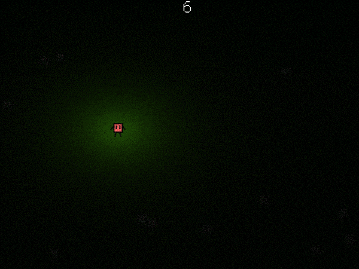

PERSPECTILT STUDIOS presents,
```
                          _               _____ ____                                    __    
   _______  ________   __(_)   _____     / ___// __ \   ________  _________  ____  ____/ /____
  / ___/ / / / ___/ | / / / | / / _ \   / __ \/ / / /  / ___/ _ \/ ___/ __ \/ __ \/ __  / ___/
 (__  ) /_/ / /   | |/ / /| |/ /  __/  / /_/ / /_/ /  (__  )  __/ /__/ /_/ / / / / /_/ (__  ) 
/____/\__,_/_/    |___/_/ |___/\___/   \____/\____/  /____/\___/\___/\____/_/ /_/\__,_/____/  
--------------------------------------------------------------------------------------------
SURVIVE 60 SECONDS v1.2
 -  A game by Kavirajar B. -
--------------------------------------------------------------------------------------------
```


### INSTRUCTIONS
How long can you survive from monsters that hunt you at dark?
```
+-------------------------------------------+
| Use <arrow keys> to move		    	        |
| Tap <z> while moving for temporary dash   |
| Hold <x> to plant lights                  |
| Press <c> to retry when you lose          |
| Press <F4> to toggle fullscreen           |
| Press <Esc> to quit                       |
+-------------------------------------------+
```

### MUSIC
Horror Ambience from https://freesound.org/s/133100/  
Thunderstorm Ambience from https://www.premiumbeat.com/blog/free-ambient-background-tracks/

### MADE WITH LÖVE2D
https://love2d.org/

### FOLLOW US ON itch.io AT
https://dataoverflow.itch.io

The game is part of GMTK Game Jam 2020 on the theme "Out Of Control"
Made in less than 48 hours! Watch out for more updates! 


HAPPY GAMING
